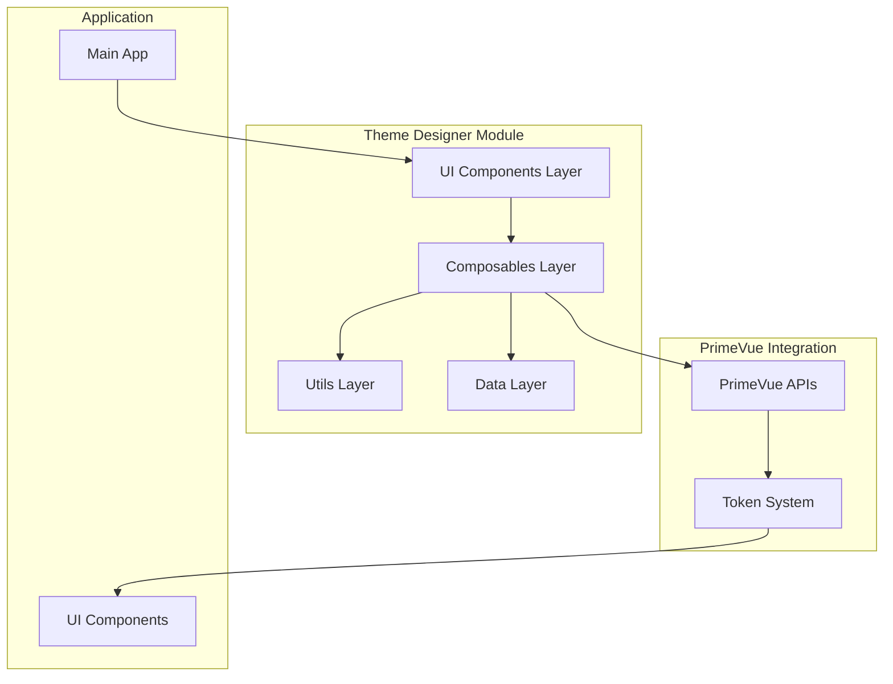

# Design Document

## Overview

The PrimeVue Theme Designer is architected as a modular, self-contained system that integrates seamlessly with existing Vue 3 + PrimeVue applications. The design follows a layered architecture with clear separation of concerns, utilizing Vue 3 Composition API patterns and reactive state management to provide an intuitive theme customization experience.

## Architecture

### System Architecture



### Module Structure

The theme designer is organized as a self-contained module in `src/theme-designer/` with the following structure:

- **Components Layer**: Vue SFC components for UI rendering
- **Composables Layer**: Business logic and state management
- **Utils Layer**: Pure functions for validation, conversion, and token mapping
- **Data Layer**: Configuration, presets, and component definitions

### State Management Pattern

The design implements a **Draft/Applied Pattern** for managing theme changes:

```javascript
const state = {
  draft: {},      // Uncommitted changes (preview only)
  applied: {},    // Currently active theme settings
  original: {}    // Baseline theme for reset functionality
}
```

This pattern ensures that:
- Changes are previewed without affecting the main application
- Users can experiment freely with settings
- Changes are only applied when explicitly confirmed
- Users can easily revert to previous states

## Components and Interfaces

### Core Components

#### ThemeDesigner.vue
**Purpose**: Main orchestrator component that coordinates the entire theme designer experience.

**Interface**:
```javascript
// Props definition
const props = defineProps({
  initialTheme: {
    type: Object,
    default: () => ({})
  },
  previewComponents: {
    type: Array,
    default: () => ['button', 'inputtext', 'select']
  },
  readonly: {
    type: Boolean,
    default: false
  }
})

// Events definition
const emit = defineEmits([
  'theme-applied',    // Emits: ThemeConfig object
  'theme-reset',      // Emits: void
  'theme-exported'    // Emits: ThemeConfig object
])
```

**Responsibilities**:
- Coordinate between preview and settings areas
- Manage overall component state
- Handle theme application and reset operations

#### ThemeDesignerDrawer.vue
**Purpose**: Collapsible side panel containing all theme customization controls.

**Features**:
- Tabbed interface for different setting categories
- Sticky header with title and close button
- Scrollable content area for settings
- Fixed footer with action buttons (Apply, Reset, Export)

#### ThemePreview.vue
**Purpose**: Live preview area showing theme changes on actual UI components.

**Features**:
- Component showcase with real PrimeVue components
- Toggle between different component examples
- Visual indicators for modified elements
- Responsive layout for different screen sizes

#### SettingControl.vue
**Purpose**: Universal control component that renders appropriate input based on setting type.

**Supported Types**:
- `color`: Color picker with palette support
- `size`: Numeric input with unit selection
- `select`: Dropdown with predefined options
- `range`: Slider with min/max constraints
- `boolean`: Toggle switch

### Control Components

#### ColorPalettePicker.vue
**Purpose**: Specialized component for selecting and customizing color palettes.

**Features**:
- Predefined palette library (Tailwind colors, Material colors)
- Custom color selection with automatic shade generation
- Live preview of palette application
- Support for primary and surface palette types

#### UnitInput.vue
**Purpose**: Input component for values with units (px, rem, em, %).

**Features**:
- Numeric validation with min/max constraints
- Unit dropdown with context-appropriate options
- Automatic value conversion between units
- Real-time validation feedback

### Section Components

#### GlobalSection.vue
**Purpose**: Settings for theme-wide properties (colors, typography, spacing).

#### ComponentGroupSection.vue
**Purpose**: Settings for groups of related components (Forms, Navigation, etc.).

#### ComponentSection.vue
**Purpose**: Settings for individual component customization.

#### PresetSection.vue
**Purpose**: Management of predefined themes and import/export functionality.

## Data Models

### Setting Definition Schema

```javascript
// Setting Definition Object Structure
const settingDefinition = {
  id: 'button.borderRadius',        // Unique identifier
  type: 'borderRadius',             // Type of control to render
  label: 'Border Radius',           // Human-readable label
  description: 'Corner rounding',   // Optional help text
  category: 'appearance',           // Grouping category
  units: ['px', 'rem', '%'],       // Supported units for size types
  defaultValue: { value: 6, unit: 'px' }, // Default value with unit
  validation: {                     // Validation constraints
    min: 0,
    max: 50,
    required: false
  },
  tokens: [                         // PrimeVue tokens affected
    'button.border.radius',
    'button.rounded.border.radius'
  ],
  dependencies: ['button.size']     // Other settings this depends on
}

// Setting Types Constants
export const SettingTypes = {
  COLOR: 'color',
  SIZE: 'size',
  SPACING: 'spacing',
  BORDER_RADIUS: 'borderRadius',
  FONT_SIZE: 'fontSize',
  FONT_WEIGHT: 'fontWeight',
  SHADOW: 'shadow',
  SELECT: 'select',
  BOOLEAN: 'boolean',
  RANGE: 'range'
}

// Unit Constants
export const Units = {
  PX: 'px',
  REM: 'rem',
  EM: 'em',
  PERCENT: '%',
  NONE: ''
}
```

### Theme Configuration Schema

```javascript
// Theme Configuration Object Structure
const themeConfig = {
  metadata: {
    name: 'My Custom Theme',
    version: '1.0.0',
    created: new Date(),
    modified: new Date()
  },
  global: {
    colors: {
      primary: {
        50: '#eff6ff',
        100: '#dbeafe',
        200: '#bfdbfe',
        // ... through 950
        950: '#1e3a8a'
      },
      surface: {
        50: '#f8fafc',
        100: '#f1f5f9',
        // ... color palette
      },
      success: '#10b981',
      warning: '#f59e0b',
      error: '#ef4444'
    },
    typography: {
      fontSize: { value: 14, unit: 'px' },
      fontWeight: 400,
      lineHeight: 1.5
    },
    spacing: {
      base: { value: 1, unit: 'rem' },
      component: { value: 0.5, unit: 'rem' }
    }
  },
  components: {
    button: {
      borderRadius: { value: 6, unit: 'px' },
      padding: { value: 12, unit: 'px' },
      // ... other button settings
    },
    inputtext: {
      borderRadius: { value: 4, unit: 'px' },
      // ... other input settings
    }
  }
}

// Color Palette Structure
const colorPalette = {
  50: '#eff6ff',
  100: '#dbeafe',
  200: '#bfdbfe',
  300: '#93c5fd',
  400: '#60a5fa',
  500: '#3b82f6',  // Base color
  600: '#2563eb',
  700: '#1d4ed8',
  800: '#1e40af',
  900: '#1e3a8a',
  950: '#172554'
}

// Size Value Structure
const sizeValue = {
  value: 16,
  unit: 'px'
}
```

### Component Definitions

```javascript
// Component Definition Object Structure
const componentDefinition = {
  id: 'button',
  name: 'Button',
  group: 'forms',
  settings: [
    'button.borderRadius',
    'button.padding',
    'button.fontSize'
  ],
  previewComponent: 'Button',
  dependencies: ['colors.primary']
}

// Component Group Object Structure
const componentGroup = {
  id: 'forms',
  name: 'Form Components',
  icon: 'pi pi-list',
  components: ['button', 'inputtext', 'select', 'checkbox'],
  description: 'Interactive form elements'
}
```

## Error Handling

### Validation Strategy

**Client-Side Validation**:
- Real-time validation as users type
- Visual feedback with error messages
- Automatic value correction where possible
- Prevention of invalid value submission

**Validation Rules**:
```javascript
// Validation Rule Object Structure
const validationRule = {
  required: false,
  min: 0,
  max: 100,
  pattern: /^#[0-9a-f]{6}$/i,
  custom: (value) => {
    // Custom validation function
    // Returns true if valid, string with error message if invalid
    return value > 0 || 'Value must be positive'
  }
}
```

**Error Display**:
- Inline error messages below invalid inputs
- Visual indicators (red borders, warning icons)
- Toast notifications for system errors
- Graceful degradation for unsupported features

### Error Recovery

**Automatic Recovery**:
- Fallback to default values for invalid settings
- Automatic correction of out-of-range values
- Graceful handling of missing dependencies

**User-Initiated Recovery**:
- Reset to last applied state
- Reset to original theme
- Import from backup configuration

## Testing Strategy

### Unit Testing

**Composables Testing**:
```javascript
// Test state management
describe('useThemeDesigner', () => {
  test('should maintain draft/applied separation', () => {
    const { draft, applied, updateSetting, hasChanges } = useThemeDesigner()
    
    updateSetting('colors.primary', 'blue')
    expect(draft.value['colors.primary']).toBe('blue')
    expect(applied.value['colors.primary']).toBeUndefined()
    expect(hasChanges.value).toBe(true)
  })
})
```

**Utilities Testing**:
```javascript
// Test validation and conversion
describe('validators', () => {
  test('should validate size values correctly', () => {
    expect(validateSize({ value: 16, unit: 'px' })).toBe(true)
    expect(validateSize({ value: -5, unit: 'px' })).toBe(false)
  })
})

describe('converters', () => {
  test('should convert units correctly', () => {
    expect(convertSize({ value: 16, unit: 'px' }, 'rem')).toEqual({
      value: 1,
      unit: 'rem'
    })
  })
})
```

### Integration Testing

**PrimeVue Integration**:
```javascript
describe('PrimeVue Integration', () => {
  test('should apply theme changes correctly', async () => {
    const { updateSetting, applyChanges } = useThemeDesigner()
    
    updateSetting('colors.primary', 'blue')
    await applyChanges()
    
    expect(mockUpdatePrimaryPalette).toHaveBeenCalledWith(
      expect.objectContaining({
        500: expect.stringMatching(/^#[0-9a-f]{6}$/i)
      })
    )
  })
})
```

### Component Testing

**UI Component Testing**:
```javascript
describe('SettingControl', () => {
  test('should render appropriate control for setting type', () => {
    const colorSetting = { type: 'color', id: 'test' }
    const wrapper = mount(SettingControl, { props: { setting: colorSetting } })
    
    expect(wrapper.findComponent(ColorPicker)).toBeTruthy()
  })
})
```

### End-to-End Testing

**User Workflow Testing**:
- Theme designer page loads correctly
- Settings changes reflect in preview
- Apply/reset functionality works
- Export/import preserves settings
- Navigation between sections works
- Responsive behavior on different screen sizes

## Performance Considerations

### Optimization Strategies

**Lazy Loading**:
- Theme designer components loaded only when accessed
- Setting definitions loaded on-demand by category
- Preview components rendered only when visible

**Reactive Optimization**:
- Use `shallowRef` for large configuration objects
- Debounced updates for real-time preview
- Computed properties for expensive calculations
- Memoization of color palette generations

**Bundle Optimization**:
- Tree-shaking of unused setting types
- Dynamic imports for preset themes
- Minimal dependencies on external libraries

### Memory Management

**State Cleanup**:
- Clear draft state when leaving theme designer
- Dispose of watchers and event listeners
- Release references to large objects

**Caching Strategy**:
- Cache generated color palettes
- Memoize validation results
- Store computed token mappings

## Security Considerations

### Input Validation

**Sanitization**:
- Validate all user inputs against expected formats
- Sanitize imported theme configurations
- Prevent injection attacks through color values or CSS

**File Upload Security**:
- Validate imported JSON structure
- Limit file size for theme imports
- Sanitize file contents before parsing

### Data Protection

**Local Storage**:
- Encrypt sensitive theme data if required
- Implement storage quotas
- Provide clear data deletion options

## Accessibility

### Keyboard Navigation

**Focus Management**:
- Logical tab order through all controls
- Visible focus indicators
- Keyboard shortcuts for common actions

**Screen Reader Support**:
- Proper ARIA labels for all controls
- Descriptive text for color values
- Status announcements for applied changes

### Visual Accessibility

**Color Contrast**:
- Ensure sufficient contrast in all theme previews
- Provide contrast validation for user-selected colors
- Support high contrast mode

**Responsive Design**:
- Mobile-friendly interface
- Touch-friendly control sizes
- Adaptive layouts for different screen sizes